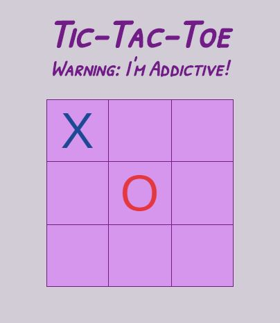

# tic-tac-toe
aka noughts and crosses, written in vanilla es6 js.
[https://jscott313.github.io/tic-tac-toe/]

## Installation
1. npm install
2. gulp

**Contributions welcome** - simply fork the repo and submit a pull request!